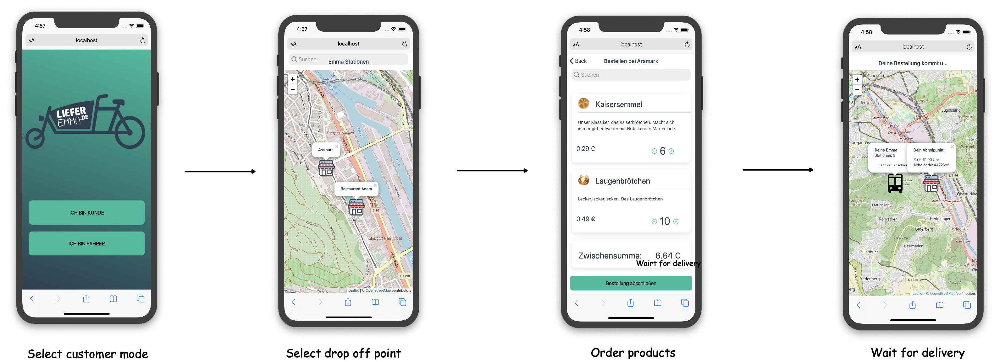
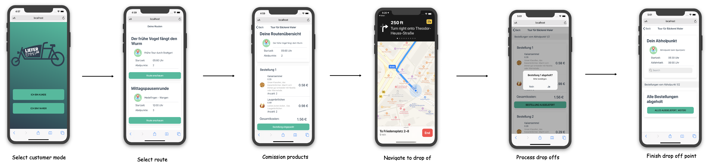

# Frontend


[](https://hub.docker.com/r/lieferemma/frontend)
[](https://discord.gg/rWWpxYG)
[](https://www.buymeacoffee.com/strobsi)

This project contains the frontend of `LIEFEREMMA`. The frontend is divided into two parts.

## Customer

The customer frontend is built for the customer, who wants to get products shipped to his neighborhood. He starts by selecting a drop off point, where he can order products from his local shop. After purchasing the products via `PayPal`, the user can simply wait for a push notification he receives from the system, once the local shop has arrived on the drop off point. During the purchase process, the customer received a unique order ID, which he has to show the local shop in order to verify himself.

### Customer Journey

The following chart shows the customer journey of the customer role.



## Driver

The driver registers by entering his shop code into the client. After entering, he receives an overview of the available routes. Once he selects a route, the driver can commission his products into his delivery vehicle. After he finished, he gets the geolocation of the first drop off point. He can simply navigate to it using `Google Maps` or `Apple Maps`.

### Driver Journey

The following chart shows the customer journey of the driver role.



## Getting started

To run the image, you can just use the already compiled docker image:

```
docker run -d -p 80:80 lieferemma/frontend
```

The project contains of two dockerfiles. One for building the app. The other for providing an image to deploy as static web app.

### Build form source

1. Build app

```bash
docker build -f Dockerfile_ionic -t emmaliefert_app:dev . && docker run -it -v ${PWD}/build:/home/alpine/app/build emmaliefert_app:dev
```

2. Deploy locally

```bash
docker build -f Dockerfile -t emmaliefert_deploy:dev . && docker run -d -p 80:80 emmaliefert_deploy:dev
```

### Development server

If you prefer, running it without Docker, you have to install ionic and then run:

```bash
ionic serve
```

You can check out the running app on `localhost:80`

## Contribute

We are organizing ourselves with plain Github Issues. You can find them here:

For further discussions, we have a [](https://discord.gg/rWWpxYG).
